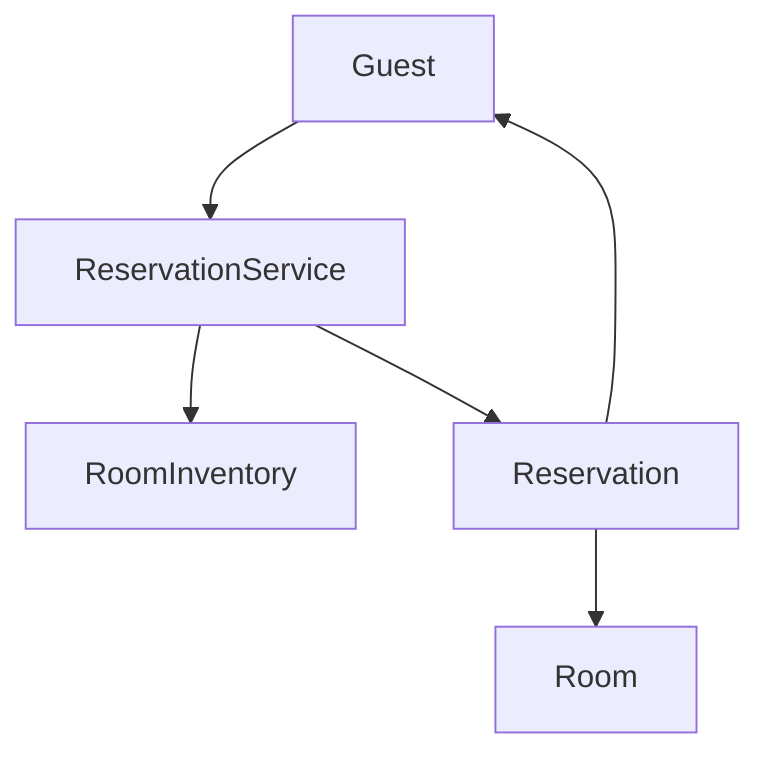
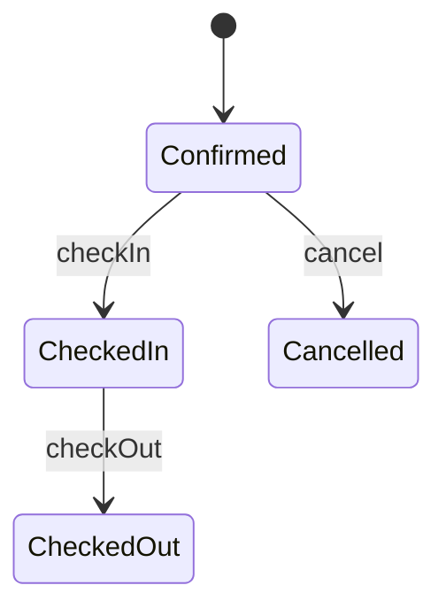
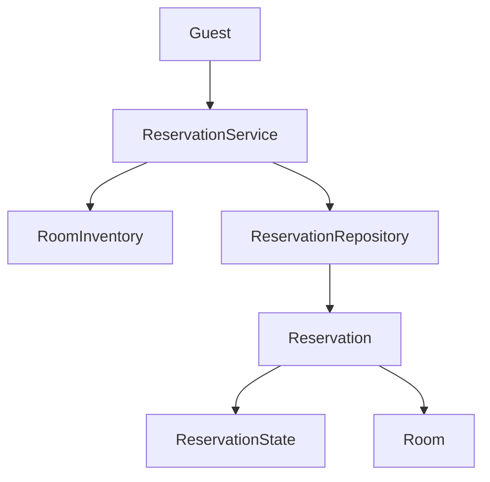

# Hotel Management System - LLD

## Context

Design a hotel management system that supports:

- Search available rooms
- Reserve room
- Check-in guest
- Check-out guest
- Generate bill

---

## Scope

### In Scope

- **Phase 1:** Search, reserve, cancel, check-in, check-out; date-overlap availability
- **Phase 2:** Repository pattern (`ReservationRepository`); State pattern (reservation lifecycle)

### Out of Scope

- Payment gateway, notifications, multi-property inventory, database

---

# Phase 1 - Core Booking Flow

## Goal

End-to-end booking from search through check-out.

## Entities

| Entity | Responsibility |
|--------|----------------|
| `Guest` | Hotel customer |
| `Room` | Room number, type, current status |
| `RoomInventory` | Stores rooms; searches by type and dates |
| `Reservation` | Guest, room, dates, lifecycle |
| `ReservationService` | Orchestrates booking; holds active reservations |
| `Bill` | Stub — not used yet |

## Enums

**RoomType:** `STANDARD`, `DELUXE`, `SUITE`

**RoomStatus:** `AVAILABLE` → `RESERVED` → `OCCUPIED` → `AVAILABLE`

## Flow

```text
Search Room → Reserve → Check-In → Check-Out
```

## Key Design

| Component | Role |
|-----------|------|
| `RoomInventory` | Filter by `RoomType`; exclude rooms with overlapping blocking reservations |
| `ReservationService` | Reserve, cancel, check-in, check-out |

**Availability** uses reservation **date overlap**, not room status alone. One room can hold multiple bookings across non-overlapping ranges.

```text
Existing Jun 3–5, request Jun 4–6 → unavailable
Existing Jun 3–5, request Jun 6–7 → available
```

Rooms track physical status; reservations and overlap logic live separately.

## Architecture



## Demo

`Client.java` — overlap blocked while checked in; booking succeeds after check-out.

---

# Phase 2 - Repository & State Patterns

## Goal

Separate reservation storage from business logic, and encapsulate lifecycle transitions in state classes.

---

## Repository Pattern

### Why

Phase 1 kept reservations inside `ReservationService`. That couples orchestration with storage and makes overlap search harder to reuse.

### Design

`ReservationRepository` abstracts how reservations are stored and retrieved.

| Method | Purpose |
|--------|---------|
| `saveReservation` | Persist new booking |
| `getAllReservations` | Feed overlap checks in `RoomInventory` |
| `getReservationById` | Lookup by id |
| `removeReservation` | Optional cleanup |

```text
ReservationService → ReservationRepository → in-memory List<Reservation>
```

- Service depends on the repository, not on `List` management.
- `RoomInventory` stays unaware of storage; the service passes `getAllReservations()` into search.
- Swapping in-memory store for DB later only changes the repository.

---

## State Pattern

### Why

Lifecycle rules (`checkIn`, `checkOut`, `cancel`) do not belong in the service as `if` checks on status.

### Entities

| Type | Classes |
|------|---------|
| `ReservationState` | `ConfirmedState`, `CheckedInState`, `CheckedOutState`, `CancelledState` |

### Lifecycle

```text
CONFIRMED → CHECKED_IN → CHECKED_OUT
CONFIRMED → CANCELLED
```



### State Behavior

| State | checkIn | checkOut | cancel |
|-------|---------|----------|--------|
| `ConfirmedState` | Room → `OCCUPIED` | ❌ | Room → `AVAILABLE` |
| `CheckedInState` | ❌ | Room → `AVAILABLE` | ❌ |
| `CheckedOutState` | ❌ | ❌ | ❌ |
| `CancelledState` | ❌ | ❌ | ❌ |

### Key Design

```text
ReservationService → reservation.checkIn() / checkOut() / cancel()
                              ↓
                    current ReservationState
```

- New reservations start in `ConfirmedState`.
- `Reservation.blocksAvailability()` — `true` for `ConfirmedState` or `CheckedInState`; used by `RoomInventory` for overlap checks.
- `ReservationService` orchestrates only; no status branching.

---

## Phase 2 Architecture



---

# Phase 3 - Billing

## Goal

Generate bill on check-out.

## Design

- `BillingService` + `PricingStrategy` (room type × nights)
- `Bill` stores amount and linked `Reservation`
- Invoke from `CheckedInState.checkOut` (or service after checkout)
