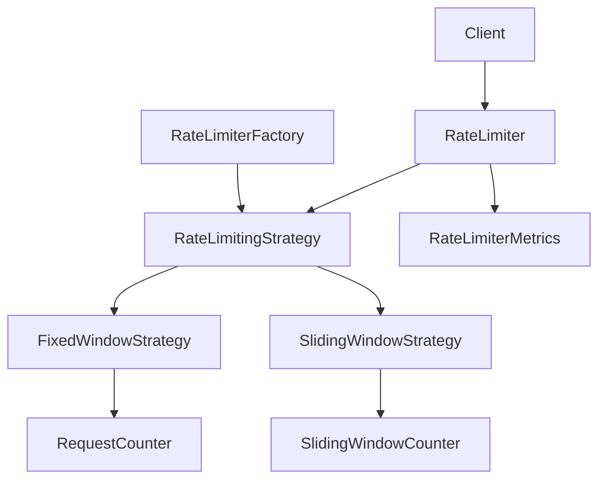

# Rate Limiter - LLD

## Context

Design a rate limiter that supports:

- Configurable request limits
- Multiple rate limiting algorithms
- Thread safety
- Extensibility
- Metrics and monitoring

---

# Core Components

| Component | Responsibility |
|---|---|
| `RateLimiter` | Facade / entry point |
| `RateLimitingStrategy` | Rate limiting algorithm |
| `RateLimitConfig` | Rate limit configuration |
| `RequestCounter` | Fixed window request tracking |
| `SlidingWindowCounter` | Sliding window request tracking |
| `RateLimiterFactory` | Creates rate limiting strategies |
| `RateLimiterMetrics` | Tracks allowed and rejected requests |

---

# Phase 1 - Fixed Window Strategy

## Goal

Limit requests within a fixed time bucket.

Example:

```text
100 requests / minute
```

## Flow

```text
Request
    ↓
RateLimiter
    ↓
FixedWindowStrategy
    ↓
Allow / Reject
```

## Design Decisions

### Strategy from Day One

Multiple algorithms are expected, so the algorithm is abstracted behind:

```text
RateLimitingStrategy
```

This keeps the limiter extensible.

### RateLimiter as Facade

`RateLimiter` acts as the entry point and delegates request validation to the configured strategy.

```text
Client
    ↓
RateLimiter
    ↓
RateLimitingStrategy
```

### RequestCounter

`RequestCounter` stores:

- request count
- window start time

This keeps fixed-window state separate from algorithm logic.

### ConcurrentHashMap

Counters are stored using:

```java
ConcurrentHashMap<String, RequestCounter>
```

This provides thread-safe counter storage per client.

### Fine-Grained Synchronization

`ConcurrentHashMap` alone is not enough because this must be atomic:

```text
check count
    ↓
increment count
```

So synchronization is done on the individual counter:

```java
synchronized(counter)
```

This allows different clients to proceed concurrently.

```text
clientA → counterA lock
clientB → counterB lock
```

---

# Phase 2 - Sliding Window Strategy

## Goal

Provide more accurate rate limiting using a rolling time window.

## Problem with Fixed Window

A client can exploit window boundaries:

```text
5 requests at 10:00:59
5 requests at 10:01:00
```

This allows too many requests in a short burst.

## Design Decisions

### SlidingWindowCounter

Fixed window needs:

```text
count + windowStartTime
```

Sliding window needs:

```text
request timestamps
```

So a separate `SlidingWindowCounter` is used.

### Deque for Timestamps

Request timestamps are stored in a `Deque`.

```text
Oldest ------------------> Newest
```

This allows:

- remove expired timestamps from the front
- add new timestamps at the end

## Algorithm

```text
Calculate window start
        ↓
Remove expired timestamps
        ↓
Check active request count
        ↓
Allow / Reject
```

---

# Phase 3 - Factory Pattern

## Goal

Centralize strategy creation.

## Design Decision

Before factory:

```text
Client
    ↓
new FixedWindowStrategy()
```

After factory:

```text
Client
    ↓
RateLimiterFactory
    ↓
RateLimitingStrategy
```

Benefits:

- Client does not depend on concrete strategies
- Strategy creation is centralized
- New algorithms can be added cleanly

---

# Phase 4 - Metrics

## Goal

Track rate limiter behavior.

Metrics captured:

- allowed requests
- rejected requests

## Design Decision

Metrics are tracked at the `RateLimiter` level.

```text
Client
    ↓
RateLimiter
    ↓
RateLimitingStrategy
```

Reason:

- Every request passes through `RateLimiter`
- Metrics are common across all strategies
- Strategies stay focused only on allow/reject logic

## synchronized vs AtomicInteger

### synchronized

```java
public synchronized void incrementAllowed() {
    allowedRequests++;
}
```

Use when:

- you want simple thread safety
- multiple related fields must be updated together
- readability is more important than performance

### AtomicInteger

```java
allowedRequests.incrementAndGet();
```

Use when:

- you are only updating independent counters
- high concurrency is expected
- you want lock-free atomic increments

## Chosen Approach

For metrics, `AtomicInteger` is the better fit because allowed and rejected counts are independent counters.

```text
allowedRequests
rejectedRequests
```

Each can be incremented atomically without locking the whole metrics object.

---

# Architecture



---

# Future Enhancements

## Advanced Concurrency

Possible improvements:

- `ReentrantLock`
- `LongAdder`
- per-client lock cleanup

## Distributed Rate Limiter

Production-ready implementation using:

- Redis
- atomic `INCR`
- TTL
- distributed deployments

---

## One-Line Summary

> RateLimiter delegates request validation to pluggable strategies and records common metrics at the facade level.