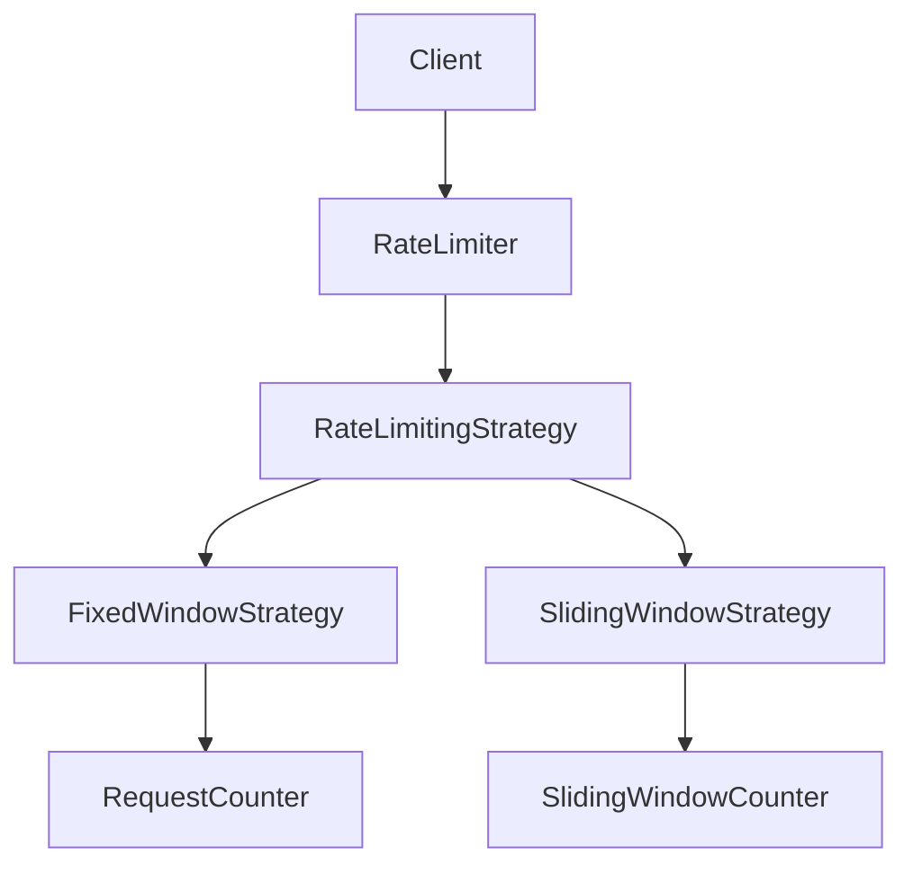

# Rate Limiter - LLD

## Context

Design a rate limiter that supports:

* Configurable request limits
* Multiple rate limiting algorithms
* Thread safety
* Extensibility
* Metrics and monitoring

---

# Core Components

| Component              | Responsibility                  |
| ---------------------- | ------------------------------- |
| `RateLimiter`          | Facade / entry point            |
| `RateLimitingStrategy` | Rate limiting algorithm         |
| `RateLimitConfig`      | Rate limit configuration        |
| `RequestCounter`       | Fixed window request tracking   |
| `SlidingWindowCounter` | Sliding window request tracking |

---

# Phase 1 - Fixed Window Strategy

## Goal

Limit requests within a fixed time bucket.

Example:

```text
100 requests / minute
```

---

## Flow

```text
Request
    ↓
RateLimiter
    ↓
FixedWindowStrategy
    ↓
Allow / Reject
```

---

## Design Decisions

### Strategy from Day One

Multiple algorithms are expected.

```text
RateLimitingStrategy
        ↓
FixedWindowStrategy
```

This keeps the limiter open for future strategies.

---

### RateLimiter as Facade

`RateLimiter` acts as the entry point and delegates request validation to the configured strategy.

```text
Client
    ↓
RateLimiter
    ↓
RateLimitingStrategy
```

---

### RequestCounter

A dedicated object stores:

* request count
* window start time

This keeps algorithm logic separate from state management.

---

### ConcurrentHashMap

Counters are stored using:

```java
ConcurrentHashMap<String, RequestCounter>
```

Benefits:

* thread-safe access
* independent counters per client

---

### Fine-Grained Synchronization

The following operation must be atomic:

```text
check count
    ↓
increment count
```

Synchronization is performed on the individual counter:

```java
synchronized(counter)
```

This allows:

```text
clientA → counterA lock
clientB → counterB lock
```

Different clients can proceed concurrently.

---

## Fixed Window Algorithm

```text
Window Expired?
        ↓
      Reset
        ↓
Count < Limit ?
        ↓
 Allow / Reject
```

---

# Phase 2 - Sliding Window Strategy

## Goal

Provide more accurate rate limiting by evaluating requests over a rolling time window.

---

## Problem with Fixed Window

A client can exploit window boundaries:

```text
5 requests at 10:00:59
5 requests at 10:01:00
```

Result:

```text
10 requests in ~1 second
```

even though the configured limit is:

```text
5 requests / minute
```

---

## Flow

```text
Request
    ↓
SlidingWindowStrategy
    ↓
Remove Expired Requests
    ↓
Active Requests < Limit ?
    ↓
Allow / Reject
```

---

## Design Decisions

### Dedicated SlidingWindowCounter

Fixed Window requires:

```text
count
windowStartTime
```

Sliding Window requires:

```text
request timestamps
```

To keep both algorithms independent:

```text
SlidingWindowCounter
        ↓
Deque<Long>
```

was introduced.

---

### Deque for Request Tracking

Requests arrive in chronological order.

```text
Oldest ------------------> Newest
```

Operations required:

* remove oldest timestamps
* add newest timestamp

`Deque` provides:

```text
O(1) insertion
O(1) removal
```

for both operations.

---

### Cleanup Before Validation

Before evaluating a request:

```text
Remove timestamps outside
the current rolling window
```

The remaining queue size represents:

```text
Active requests inside window
```

---

### Per-Client Synchronization

Just like Fixed Window:

```java
synchronized(counter)
```

is used to protect:

```text
remove expired timestamps
    ↓
check limit
    ↓
add timestamp
```

as a single atomic operation.

---

## Sliding Window Algorithm

```text
Current Time
        ↓
Calculate Window Start
        ↓
Remove Expired Requests
        ↓
Active Requests < Limit ?
        ↓
Allow / Reject
```

---

## Architecture



---


# Phase 3 - Factory Pattern

## Goal

Centralize strategy creation and remove client dependency on concrete implementations.

## Design Decision
```
Before:

Client
↓
new FixedWindowStrategy()

---

After:

Client
↓
RateLimiterFactory
↓
RateLimitingStrategy
```
Benefits:
- Centralized object creation
- Easier to add new algorithms
- Reduced client coupling

# Future Enhancements

## Phase 4 - Metrics

Track:

* allowed requests
* rejected requests
* per-client statistics

---

## Phase 5 - Advanced Concurrency

Possible improvements:

* `ReentrantLock`
* `AtomicInteger`
* `LongAdder`

---

## Phase 6 - Distributed Rate Limiter

Production-ready implementation using:

* Redis
* Atomic INCR
* TTL
* Distributed deployments

---

## One-Line Summary

> RateLimiter delegates request validation to pluggable rate limiting strategies while maintaining thread-safe request tracking per client.
