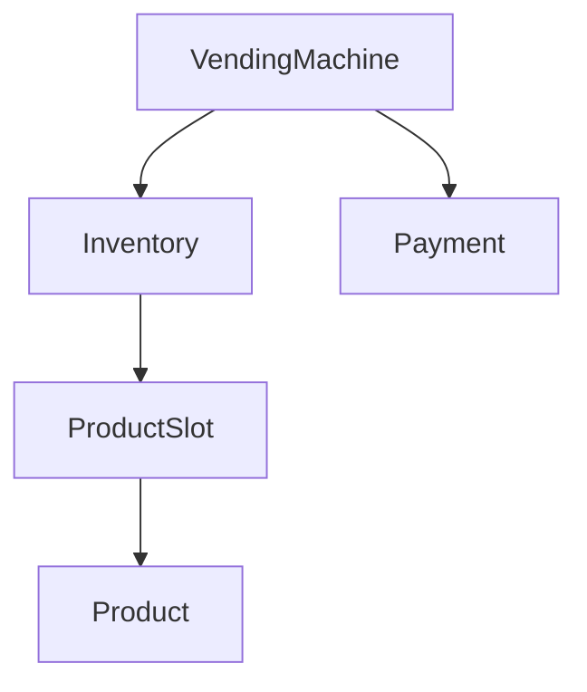
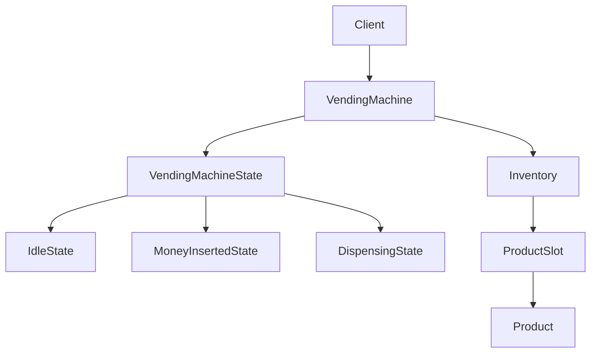

# Vending Machine - LLD

## Context

Design a vending machine that supports:

* View products
* Insert money
* Select product
* Dispense product
* Return change

---

# Phase 1 - Core Purchase Flow

## Core Entities

| Entity           | Responsibility                    |
| ---------------- | --------------------------------- |
| `Product`        | Product metadata                  |
| `ProductSlot`    | Product inventory                 |
| `Inventory`      | Stores and searches product slots |
| `Payment`        | User payment information          |
| `VendingMachine` | Purchase orchestration            |

---

## Core Flow

```text
Insert Money
    ↓
Select Product
    ↓
Validate Funds
    ↓
Dispense Product
    ↓
Return Change
```

---

## Design Decisions

### Product vs ProductSlot

`Product` stores catalog information:

* id
* name
* price

`ProductSlot` stores inventory information:

* product
* quantity

This separates product metadata from stock management.

### Inventory Responsibility

`Inventory` is responsible for:

* storing product slots
* product lookup

It does not handle purchase workflows.

### VendingMachine as Orchestrator

`VendingMachine` orchestrates the complete purchase flow:

```text
Insert Money
    ↓
Select Product
    ↓
Validate Funds
    ↓
Dispense Product
    ↓
Return Change
```

Business workflow is centralized in the machine rather than distributed across inventory and product classes.

## Architecture


---

# Phase 2 - State Pattern

## Goal

Ensure vending machine operations happen in the correct order.

```text
IdleState
    ↓ insertMoney
MoneyInsertedState
    ↓ selectProduct
DispensingState
    ↓ dispense + return change
IdleState
```

---

## States

| State | Allowed Action |
|---|---|
| `IdleState` | Insert money |
| `MoneyInsertedState` | Select product |
| `DispensingState` | Dispense product and return change |

---

## Design Decisions

### State Pattern

`VendingMachine` delegates user actions to the current state.

This prevents invalid flows like:

```text
selectProduct() before insertMoney()
```

### Selected Product Handling

After product selection, the selected `ProductSlot` is stored inside `VendingMachine`.

This avoids selecting one product and dispensing another.

### Reset After Dispense

After dispensing:

* payment is cleared
* selected product is cleared
* machine returns to `IdleState`

---

## Updated Architecture



---

## One-Line Summary

> State Pattern controls valid vending machine actions and keeps the purchase flow consistent.

---

## One-Line Summary

> VendingMachine orchestrates product purchase while Inventory manages product availability and ProductSlot manages stock.