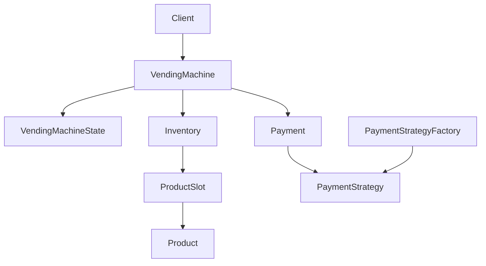

# Vending Machine - LLD

## Context

Design a vending machine that supports:

* View products
* Insert money
* Select product
* Dispense product
* Return change

---

# Core Entities

| Entity | Responsibility |
|---|---|
| `Product` | Product metadata |
| `ProductSlot` | Product inventory and quantity |
| `Inventory` | Stores and searches product slots |
| `Payment` | Payment information |
| `VendingMachine` | Purchase orchestration |

---

# Phase 1 - Core Purchase Flow

## Flow

```text
Insert Money
    ↓
Select Product
    ↓
Validate Funds
    ↓
Dispense Product
    ↓
Return Change
```

## Design Decisions

### Product vs ProductSlot

`Product` stores catalog information:

* id
* name
* price

`ProductSlot` stores inventory information:

* product
* quantity

This separates product metadata from stock management.

### Inventory Responsibility

`Inventory` is responsible for:

* storing slots
* product lookup

### VendingMachine Responsibility

`VendingMachine` orchestrates:

* validating funds
* product selection
* dispensing products
* returning change

---

# Phase 2 - State Pattern

## Goal

Ensure operations happen in the correct order.

## States

```text
IdleState
MoneyInsertedState
DispensingState
```

## State Flow

```text
IdleState
    ↓ insertMoney
MoneyInsertedState
    ↓ selectProduct
DispensingState
    ↓ dispenseProductAndReturnChange
IdleState
```

## Design Decision

State-specific behavior is moved from `VendingMachine` into state objects.

---

# Phase 3 - Strategy Pattern

## Goal

Support multiple payment methods.

## Strategies

```text
PaymentStrategy
    ├── CashPaymentStrategy
    ├── CreditCardPaymentStrategy
    └── UpiPaymentStrategy
```

## Design Decision

Payment processing behavior varies by payment type and is encapsulated behind a common strategy interface.

---

# Phase 4 - Factory Pattern

## Goal

Centralize payment strategy creation.

## Flow

```text
PaymentMode
    ↓
PaymentStrategyFactory
    ↓
PaymentStrategy
```

## Design Decision

Client asks the factory for a payment strategy instead of directly creating concrete strategy objects.

---

# Phase 5 - Concurrency

## Goal

Prevent overselling when multiple users try to buy the last item at the same time.

## Critical Section

```text
check quantity
    ↓
decrement quantity
```

## Design Decision

`ProductSlot` owns product quantity, so quantity mutation is synchronized inside `ProductSlot`.

```text
ProductSlot.quantity
        ↓
synchronized decrementQuantity()
```

This ensures stock check and decrement happen atomically.

## Better Alternatives

* `ReentrantLock` → timeout / fairness / tryLock
* `@Transactional` → DB-backed inventory
* `@Version` → optimistic locking
* Distributed lock → multi-server setup

---
# Phase 6 - ReentrantLock

## Goal

Improve concurrency control for product stock updates.

## Design Change

Replaced `synchronized` with `ReentrantLock` in `ProductSlot`.

```text
ProductSlot
    ↓
quantity
    ↓
decrementQuantity()
```

## Why Move Beyond synchronized?

`synchronized` is simple and sufficient for an MVP, but it provides limited control over lock acquisition.

`ReentrantLock` offers:

* `tryLock()` support
* configurable timeouts
* fairness policies
* explicit lock management
* better extensibility for future requirements

## Fair vs Unfair Locking

### Fair Lock

```java
new ReentrantLock(true)
```

Locks are granted in roughly FIFO order.

```text
Thread A waiting
Thread B waiting
Thread C waiting

A → B → C
```

Pros:

* Prevents thread starvation
* Predictable behavior

Cons:

* Lower throughput

### Unfair Lock (Default)

```java
new ReentrantLock()
```

A newly arriving thread may acquire the lock before older waiting threads.

Pros:

* Better throughput
* Lower overhead

Cons:

* Possible starvation under heavy contention

## Design Decision

Used:

```java
new ReentrantLock(true)
```

to ensure fair access when multiple users attempt to purchase the same product concurrently.


# Architecture



---

## One-Line Summary

> VendingMachine orchestrates purchases, State Pattern controls machine behavior, Strategy Pattern handles payment processing, Factory creates payment strategies, and ProductSlot synchronization prevents overselling.