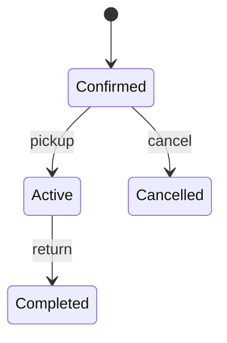
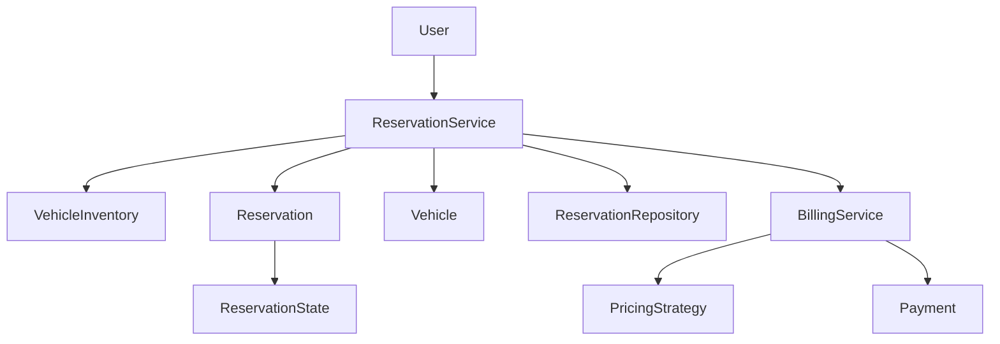

# Car Rental System - LLD

## General Context

Design a simple car rental system where a user can search for vehicles, reserve a vehicle, pick it up, return it, and generate payment.

The design is MVP-focused and gradually extended with state handling and concurrency control.

---

## Scope

### In Scope
- Search available vehicles
- Reserve vehicle
- Pick up vehicle
- Return vehicle
- Generate payment
- Prevent concurrent double reservation

### Out of Scope
- Real payment gateway
- Notifications
- Insurance/add-ons
- Multi-branch inventory
- Database integration

---

## Core Entities

| Entity | Responsibility |
|---|---|
| `User` | Customer renting a vehicle |
| `Vehicle` | Rentable vehicle with current availability status |
| `VehicleInventory` | Stores and searches vehicles |
| `Reservation` | Tracks rental lifecycle |
| `ReservationService` | Orchestrates reservation flow |
| `ReservationState` | Handles reservation state behavior |
| `BillingService` | Generates payment |
| `PricingStrategy` | Calculates rental amount |
| `Payment` | Stores payment outcome |

---

## Core Flow

```text
Search Vehicle
      ↓
Reserve Vehicle
      ↓
Pick Up Vehicle
      ↓
Return Vehicle
      ↓
Generate Payment
````

---

# Phase 1 - Core Functionalities

## Goal

Build the basic rental flow.

## Flow

```text
User searches available vehicle
        ↓
User reserves vehicle
        ↓
Vehicle marked RESERVED
        ↓
User picks up vehicle
        ↓
Vehicle marked RENTED
        ↓
User returns vehicle
        ↓
Vehicle marked AVAILABLE
        ↓
Payment generated
```

## Key Design

* `VehicleInventory` handles searching.
* `ReservationService` handles reservation orchestration.
* `BillingService` uses `PricingStrategy` to calculate amount.
* `Payment` only stores the payment result.

---

# Phase 2 - State Pattern

## Why

Reservation lifecycle has multiple states:

```text
CONFIRMED → ACTIVE → COMPLETED
CONFIRMED → CANCELLED
```

Manual `if-else` checks become hard to maintain as states grow.

## Design

Use State Pattern:

| State            | Meaning                            |
| ---------------- | ---------------------------------- |
| `ConfirmedState` | Vehicle reserved, ready for pickup |
| `ActiveState`    | Vehicle picked up and in use       |
| `CompletedState` | Vehicle returned                   |
| `CancelledState` | Reservation cancelled              |

## Flow



## Key Idea

```text
Reservation delegates behavior to current ReservationState
```

So instead of:

```text
ReservationService checks status using if-else
```

we do:

```text
reservation.pickupVehicle()
reservation.returnVehicle()
reservation.cancelReservation()
```

The current state decides whether the action is allowed.

---

# Phase 3 - Concurrency using synchronized

## Problem

Multiple users may try to reserve the same vehicle at the same time.

Without concurrency control:

```text
Thread A sees AVAILABLE
Thread B sees AVAILABLE
Both reserve same vehicle ❌
```

## Solution

Use `synchronized` inside `Vehicle.reserve()`.

```text
Vehicle owns availability state
Vehicle controls status mutation
```

This makes:

```text
check availability + mark RESERVED
```

atomic.

## Design Decision

* Vehicle status changes are handled inside `Vehicle`.
* `reserve()` is synchronized.
* Locking happens per vehicle object, not globally.
* This prevents double reservation while allowing different vehicles to be reserved concurrently.

## Better Alternatives Discussed

| Option           | When to Use                                                                     |
| ---------------- | ------------------------------------------------------------------------------- |
| `synchronized`   | Simple MVP, basic mutual exclusion                                              |
| `ReentrantLock`  | Need timeout, `tryLock`, fairness, interruptible locking                        |
| `@Transactional` | DB-backed system where vehicle update + reservation save must rollback together |
| DB row locking   | Production-grade concurrent reservation with persistence                        |

## Key Rule

> Reserve vehicle + create reservation should behave atomically.

For in-memory MVP, we use `synchronized`.

For real production systems, we would use:

```text
Database transaction + row-level locking / distributed locking
```

---

## Architecture Overview



---

## One-Line Summary

> The system starts with a simple rental flow, uses State Pattern for reservation lifecycle, and uses synchronized vehicle-level reservation to prevent concurrent double booking.


