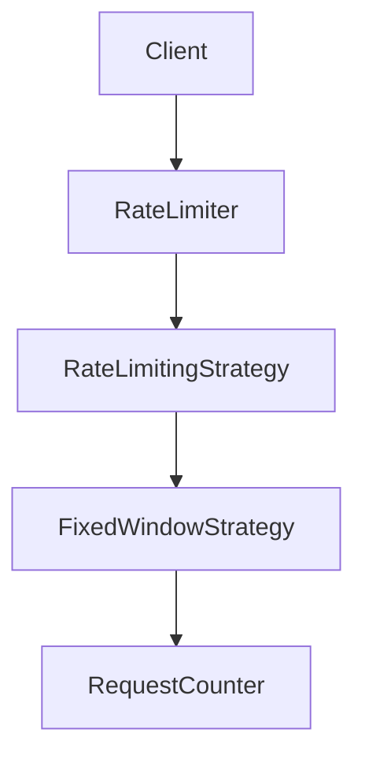

# Rate Limiter - LLD

## Context

Design a rate limiter that supports:

* Configurable request limits
* Different rate limiting algorithms
* Thread safety
* Extensibility
* Metrics and monitoring

---

# Core Components

| Component              | Responsibility              |
| ---------------------- | --------------------------- |
| `RateLimiter`          | Facade / entry point        |
| `RateLimitingStrategy` | Rate limiting algorithm     |
| `RateLimitConfig`      | Limit configuration         |
| `RequestCounter`       | Per-client request tracking |

---

# Phase 1 - Fixed Window Rate Limiter

## Goal

Limit requests within a fixed time window.

Example:

```text
100 requests / minute
```

---

## Core Flow

```text
Request
    ↓
RateLimiter
    ↓
FixedWindowStrategy
    ↓
Allow / Reject
```

---

## Design Decisions

### Strategy from Day One

Requirements explicitly mention support for multiple rate limiting algorithms.

To avoid coupling the limiter to a specific implementation:

```text
RateLimitingStrategy
        ↓
FixedWindowStrategy
```

was introduced from the beginning.

---

### RateLimiter as Facade

`RateLimiter` acts as the entry point and delegates request validation to the configured strategy.

```text
Client
    ↓
RateLimiter
    ↓
RateLimitingStrategy
```

---

### RequestCounter

Request tracking was extracted into a dedicated object.

Responsible for:

* request count
* window start time

This keeps strategy logic focused on rate limiting rules.

---

### ConcurrentHashMap

Counters are stored using:

```java
ConcurrentHashMap<String, RequestCounter>
```

Benefits:

* concurrent reads
* concurrent writes
* thread-safe client counter storage

---

### Fine-Grained Synchronization

A `ConcurrentHashMap` alone is not sufficient.

The following operation must be atomic:

```text
check count
    ↓
increment count
```

To prevent race conditions, synchronization is performed on the individual `RequestCounter`.

```java
synchronized(counter)
```

Benefits:

* correctness for the same client
* parallelism across different clients

```text
clientA → counterA lock
clientB → counterB lock
```

Different clients can proceed concurrently.

---

## Fixed Window Algorithm

```text
Window Expired?
        ↓
      Reset
        ↓
Count < Limit ?
        ↓
 Allow / Reject
```

---

## Architecture



---

# Future Enhancements

## Phase 2 - Sliding Window Strategy

```text
RateLimitingStrategy
    ├── FixedWindowStrategy
    └── SlidingWindowStrategy
```

Provides smoother request distribution.

---

## Phase 3 - Factory Pattern

```text
RateLimitConfig
        ↓
RateLimiterFactory
        ↓
RateLimitingStrategy
```

Centralizes strategy creation.

---

## Phase 4 - Metrics

Track:

* allowed requests
* rejected requests
* per-client statistics

---

## Phase 5 - Advanced Concurrency

Possible improvements:

* `ReentrantLock`
* `AtomicInteger`
* `LongAdder`

---

## Phase 6 - Distributed Rate Limiter

Production-ready implementation using:

* Redis
* Atomic INCR
* TTL
* Distributed deployments

---

## One-Line Summary

> RateLimiter delegates request validation to pluggable rate limiting strategies while maintaining thread-safe request counters per client.
