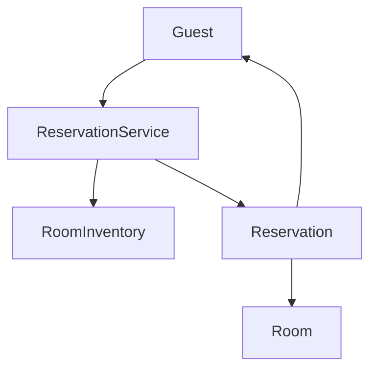

# Hotel Management System - LLD

## Context

Design a hotel management system that supports:

- Search available rooms
- Reserve room
- Check-in guest
- Check-out guest
- Generate bill

---

## Scope

### In Scope (Phase 1)

- Search rooms by type and date range
- Reserve, cancel, check-in, check-out
- Date-overlap availability

### Out of Scope

- Payment gateway, notifications, multi-property inventory, database

---

# Phase 1 - Core Booking Flow

## Goal

End-to-end booking from search through check-out.

## Entities

| Entity | Responsibility |
|--------|----------------|
| `Guest` | Hotel customer |
| `Room` | Room number, type, current status |
| `RoomInventory` | Stores rooms; searches by type and dates |
| `Reservation` | Guest, room, dates, booking status |
| `ReservationService` | Orchestrates booking lifecycle |
| `Bill` | Stub only — not used in flow yet |

## Enums

**RoomType:** `STANDARD`, `DELUXE`, `SUITE`

**RoomStatus:** `AVAILABLE` → `RESERVED` → `OCCUPIED` → `AVAILABLE`

**BookingStatus:** `CONFIRMED` → `CHECKED_IN` → `CHECKED_OUT`  
Branch: `CONFIRMED` → `CANCELLED`

## Flow

```text
Search Room → Reserve → Check-In → Check-Out
```

## Key Design

| Component | Role |
|-----------|------|
| `RoomInventory` | Filter by `RoomType`; skip rooms with overlapping active reservations |
| `ReservationService` | Reserve, cancel, check-in, check-out; owns the reservation list |

**Availability** uses reservation **date overlap**, not room status alone. One room can hold multiple bookings across non-overlapping ranges.

```text
Existing Jun 3–5, request Jun 4–6 → unavailable
Existing Jun 3–5, request Jun 6–7 → available
```

Overlap check ignores `CANCELLED` and `CHECKED_OUT` reservations. Active reservations live in `ReservationService`; rooms only track current physical status.

## Architecture



## Demo

`Client.java` — overlap rejection while checked in, then successful booking after check-out.

---

# Phase 2 - State Pattern

## Why

`ReservationService` uses `if` checks on `BookingStatus` for cancel, check-in, and check-out. States will grow; encapsulate transitions per state.

## Design

| State | Meaning |
|-------|---------|
| `ConfirmedState` | Reserved, ready for check-in |
| `CheckedInState` | Guest in room |
| `CheckedOutState` | Stay completed |
| `CancelledState` | Reservation cancelled |

`Reservation` delegates behavior to `ReservationState` instead of status enums + guards in the service.

---

# Phase 3 - Billing

## Goal

Generate bill on check-out.

## Design

- `BillingService` computes amount (e.g. via `PricingStrategy` by room type and nights)
- `Bill` stores amount and linked `Reservation`
- Hook from `checkOutGuest` after status moves to `CHECKED_OUT`
