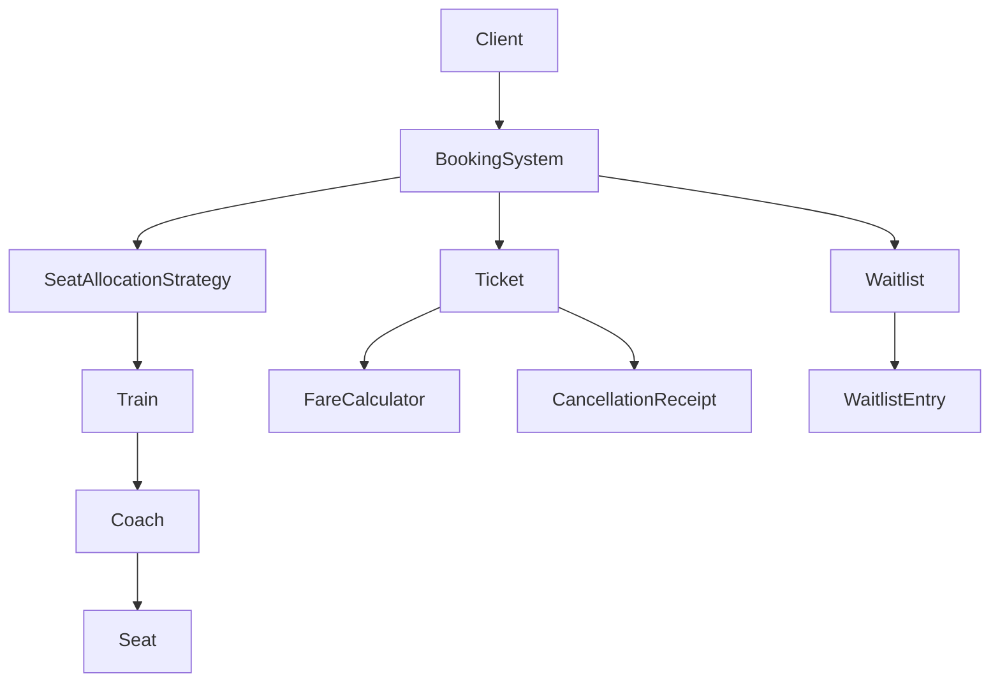

# Design IRCTC - Train Ticket Booking System

## Context

Design an IRCTC-like train ticket booking system that supports:

* Multiple trains with multiple coach types (AC, Sleeper, General)
* Concurrent seat booking without double-booking
* Pluggable seat allocation strategies
* Waitlist management with auto-promotion on cancellation
* Fare calculation and time-based refunds

---

# Core Entities

| Entity | Responsibility |
|---|---|
| `Train` | Holds coaches and the per-coach-type available-seats queue |
| `Coach` | Fixed collection of seats for a coach id/type |
| `Seat` | Single reservable unit; owns its own reservation lock |
| `Passenger` | Passenger identity |
| `Ticket` | Booking record: PNR, seat, fare, status |
| `Waitlist` / `WaitlistEntry` | Per-train, per-coach-type FIFO queue of pending tickets |
| `SeatAllocationStrategy` | Pluggable seat-picking policy |
| `FareCalculator` | Base fare x berth multiplier pricing |
| `BookingSystem` | Orchestrator; singleton entry point |
| `CancellationReceipt` | Refund record returned on cancellation |

Enums: `CoachType`, `BirthType`, `BookingStatus`

---

# Phase 1 - Domain Skeleton

## Goal

Model the train/coach/seat/passenger/ticket hierarchy the rest of the system builds on.

## Design Decisions

### BirthType carries priority

`BirthType` stores a numeric `priority` so seats can be ordered by berth desirability without a separate comparator:

```text
LOWER(1) < SIDE_LOWER(2) < MIDDLE(3) < SIDE_UPPER(4) < UPPER(5)
```

### Coach seats are immutable after construction

`Coach` builds all its `Seat`s in the constructor from `BirthType.getBirthCycle(coachType)` and exposes them via `Collections.unmodifiableList`. Seats aren't added or removed after that.

---

# Phase 2 - Seat Allocation Strategies

## Goal

Support multiple ways of picking a seat behind one interface.

## Strategies

```text
SeatAllocationStrategy
    ├── LowerBirthFirst        (PriorityQueue ordered by BirthType priority)
    └── FirstAvailableStrategy (linear scan, first unreserved seat)
```

## Design Decision

`Train` keeps **one `PriorityQueue<Seat>` per `CoachType`**, not per `Coach`. That means `LowerBirthFirst` drains every LOWER berth across *all* coaches of that type before it ever offers a MIDDLE/UPPER/SIDE seat.

---

# Phase 3 - Booking Orchestration

## Goal

Tie strategy selection, seat reservation, and ticket issuance together behind one entry point.

## Flow

```text
bookTicket(passenger, trainNumber, coachType)
    ↓
strategy.allocateSeats(train, coachType)
    ↓
seat.reserve(passenger)
    ├── success        → Ticket(CONFIRMED)
    └── fail / no seat → Waitlist.add() → Ticket(WAITLISTED)
```

## Design Decision

PNRs are generated from a single `AtomicLong` counter so concurrent bookings never collide on PNR, without needing a lock.

---

# Phase 4 - Waitlist & Cancellation

## Goal

Reclaim a cancelled seat for the next waiting passenger instead of just freeing it.

## Flow

```text
cancelTicket(ticket)
    ↓
seat.release()
    ↓
waitlist.pollNext(coachType)
    ├── entry found → seat.reserve(entry.passenger) + entry.confirm(seat)
    └── empty       → train.returnSeat(seat)
```

## Design Decision

Promotion and re-enqueue are mutually exclusive: a freed seat either goes straight to the next waitlisted passenger, or back into the available-seats queue — never both. This invariant is also what keeps the locking in Phase 6 simple: a seat that's mid-cancellation is never reachable through the queue at the same time.

---

# Phase 5 - Fare & Refund

## Goal

Price a ticket at booking time and compute a time-based refund at cancellation.

## Design Decisions

### Fare = base fare x berth multiplier

```text
FareCalculator.calculate(train, coachType, seat)
    = BASE_FARES[coachType] * BERTH_MULTIPLIERS[seat.birthType]
```

A waitlisted ticket (no seat yet) pays base fare only — no berth is assigned to apply a multiplier to.

### Fare is frozen at booking time

`Ticket` computes and stores `fare` once, in its constructor. Later changes to pricing tables can't retroactively change what an already-booked passenger paid.

### Refund tiers (time since booking)

```text
< 24h  → 50% refund
< 48h  → 75% refund
>= 48h → 100% refund
```

---

# Phase 6 - Concurrency

## Goal

Prevent double-booking and `PriorityQueue` corruption when multiple passengers book concurrently, and make `BookingSystem` safe to share across threads.

## Two-Level Locking

```text
Seat reservation → per-seat        ReentrantLock (tryLock)
Queue mutation   → per-coach-type  ReentrantLock
```

## Design Decisions

### Seat-level locking

`Seat.reserve()` / `release()` are guarded by a `ReentrantLock` owned by the seat itself, using `tryLock()` rather than a blocking `lock()`:

```text
tryLock() fails → return false immediately
                 → caller tries a different seat instead of waiting
```

### Queue-level locking

`Train.availableSeats` holds one `PriorityQueue<Seat>` per `CoachType`, each guarded by its own `ReentrantLock`. Every mutation (`addCoach`, `pollAvailableSeat`, `returnSeat`) takes that lock, so concurrent `poll()`/`offer()` can't corrupt the heap.

### Poll implies exclusive ownership

Once `pollAvailableSeat()` removes a seat from the queue, no other thread has a path back to that exact seat until it's reserved or re-enqueued on cancellation. `LowerBirthFirst`'s post-poll `isReserved()` retry is defensive — it guards against that invariant ever breaking, not a race that occurs today.

### BookingSystem is a singleton

Double-checked locking with a `private` constructor and `volatile` instance field, so only one `BookingSystem` exists per JVM and every caller goes through `getInstance()`.

---

# Architecture



---

## One-Line Summary

> `BookingSystem` orchestrates ticket booking behind a pluggable `SeatAllocationStrategy`, `Waitlist` auto-promotes a cancelled seat to the next passenger, `FareCalculator` prices tickets at booking time, and per-seat plus per-coach-type-queue locking keep concurrent bookings free of double-booking and heap corruption.
