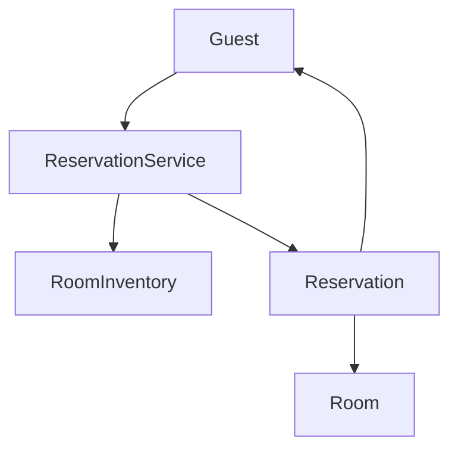

# Hotel Management System - LLD

## Context

Design a hotel management system that supports:
- Search available rooms
- Reserve room
- Check-in guest
- Check-out guest
- Generate bill

---

# Phase 1 - Core Booking Flow

## Core Entities

| Entity | Responsibility |
|----------|---------------|
| `Guest` | Hotel customer |
| `Room` | Hotel room |
| `RoomInventory` | Stores and searches rooms |
| `Reservation` | Booking details |
| `ReservationService` | Booking orchestration |
| `Bill` | Final bill |

---

## Room Types

```text
STANDARD
DELUXE
SUITE
````

---

## Room Status

```text
AVAILABLE
RESERVED
OCCUPIED
```

---

## Booking Status

```text
CONFIRMED
CHECKED_IN
CHECKED_OUT
CANCELLED
```

---

## Core Flow

```text
Search Room
    ↓
Reserve Room
    ↓
Check-In
    ↓
Check-Out
```

---

## Design Decisions

### RoomInventory

Responsible for:

* storing rooms
* searching available rooms

### ReservationService

Responsible for:

* reserve room
* cancel reservation
* check-in guest
* check-out guest

### Room Lifecycle

```text
AVAILABLE
    ↓
RESERVED
    ↓
OCCUPIED
    ↓
AVAILABLE
```

### Reservation Lifecycle

```text
CONFIRMED
    ↓
CHECKED_IN
    ↓
CHECKED_OUT

CONFIRMED
    ↓
CANCELLED
```

---

## Architecture



---

## One-Line Summary

> ReservationService orchestrates room booking, check-in, and check-out while RoomInventory manages room availability.

```

This sets up Phase 2 (State Pattern) very naturally because the reservation lifecycle is already visible in the README.
```

---

