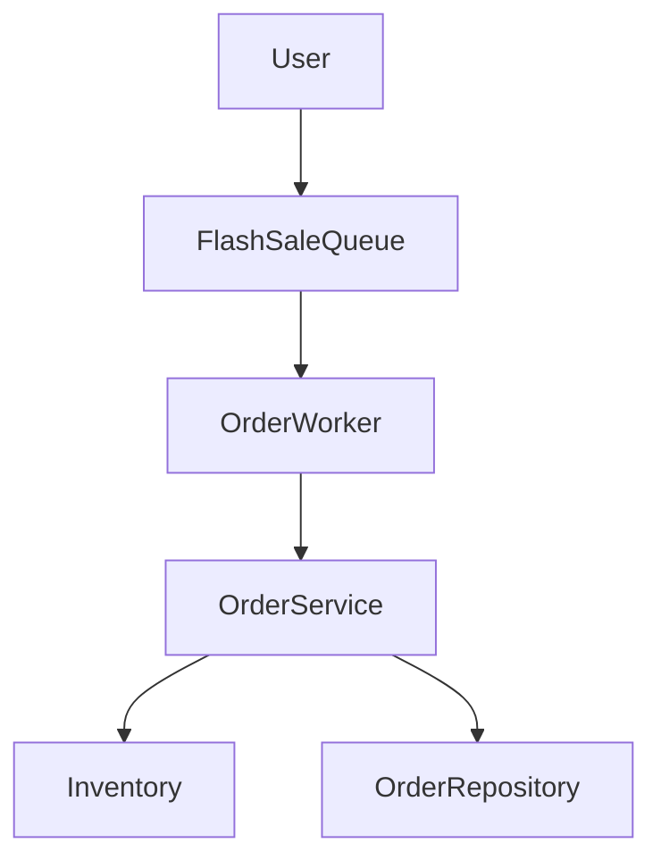
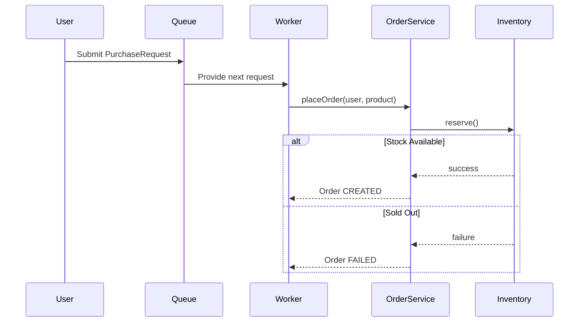

# 🧠 Flash Sale System – MVP

A simple flash sale system that handles high concurrency while ensuring no overselling.

---

## 🎯 Assumptions

* Single flash sale event
* Multiple products supported (one product per order)
* In-memory storage
* No payment flow
* One user can buy only one unit per product
* Main goal: **no overselling under concurrency**

---

## 🧩 Core Components

| Class             | Responsibility              |
| ----------------- | --------------------------- |
| `User`            | Buyer placing order         |
| `Product`         | Item being sold             |
| `Inventory`       | Manages stock for a product |
| `Order`           | Represents purchase outcome |
| `OrderService`    | Handles order placement     |
| `OrderRepository` | Stores successful orders    |

---

## ⚙️ End-to-End Flow

```text
User clicks Buy
        ↓
OrderService.placeOrder()
        ↓
Check duplicate purchase (same user + product)
        ↓
Fetch Inventory for product
        ↓
Inventory.reserve()  (atomic)
        ↓
If success:
    create order
    save order
Else:
    return failed
```

---

## 🧠 Key Design Decisions

* **Encapsulation**

    * Inventory owns stock and controls stock changes

* **Concurrency Control**

    * Used `synchronized` inside `Inventory.reserve()`
    * Ensures atomic **check + decrement**
    * Lock is per product → better concurrency

* **No Overselling**

    * Stock is reduced only inside synchronized block

* **Duplicate Order Prevention**

    * Used a thread-safe set (`ConcurrentHashMap`)
    * Key = `userId:productId`
    * Ensures one successful purchase per user

---

## ⚠️ Critical Rule

> **Check stock + decrement must be atomic**

---

## 🚀 Concurrency Strategy

```text
Each product has its own Inventory object
        ↓
Each Inventory has its own lock
        ↓
No global lock → better performance
```

---

# 🔁 Phase 2: Fairness Queue

## 🎯 Problem

In MVP, requests compete using threads:

```text
Fast thread wins ❌
Slow thread loses ❌
```

This is not fair.

---

## 🧠 Solution

Introduce a **Fairness Queue (FIFO)**

```text
User requests → Queue → Worker → OrderService
```

Requests are processed in the order they arrive.

---

## ⚙️ Updated Flow

```text
User clicks Buy
        ↓
Create PurchaseRequest
        ↓
Add to Queue
        ↓
Worker picks request (FIFO)
        ↓
OrderService.placeOrder()
        ↓
Inventory.reserve()

```
---

## 📦 Understanding BlockingQueue

**What is `BlockingQueue`?**

* A **thread-safe queue** from `java.util.concurrent`
* Designed for **producer/consumer** scenarios
* **Blocks (waits)** when:
    * Queue is empty → `take()` waits until item is available
    * Queue is full → `put()` waits until space is available

**What is `LinkedBlockingQueue`?**

* A common implementation of `BlockingQueue`
* Uses **linked nodes** internally
* Can be **unbounded** (default) or **bounded** (with capacity limit)
* Perfect for our fairness queue: workers wait when no requests are available

**Why use it here?**

* Workers don't need to repeatedly check if requests are available
* Workers automatically **wait** when queue is empty
* Workers automatically **wake up** when new requests arrive


---

## 🧠 Key Points

* Ensures **first come → first served**
* Removes dependency on thread scheduling
* Improves fairness and predictability
* Still uses `Inventory.reserve()` for correctness

---

## 🧠 One-Line Summary

> **Queue ensures fairness, Inventory ensures correctness**

---

# 📊 Architecture Diagram



---

# 🔄 Sequence Flow



---

# 🧠 One-Line Summary

> **Inventory ensures correctness, Queue ensures fairness, OrderService orchestrates flow.**

