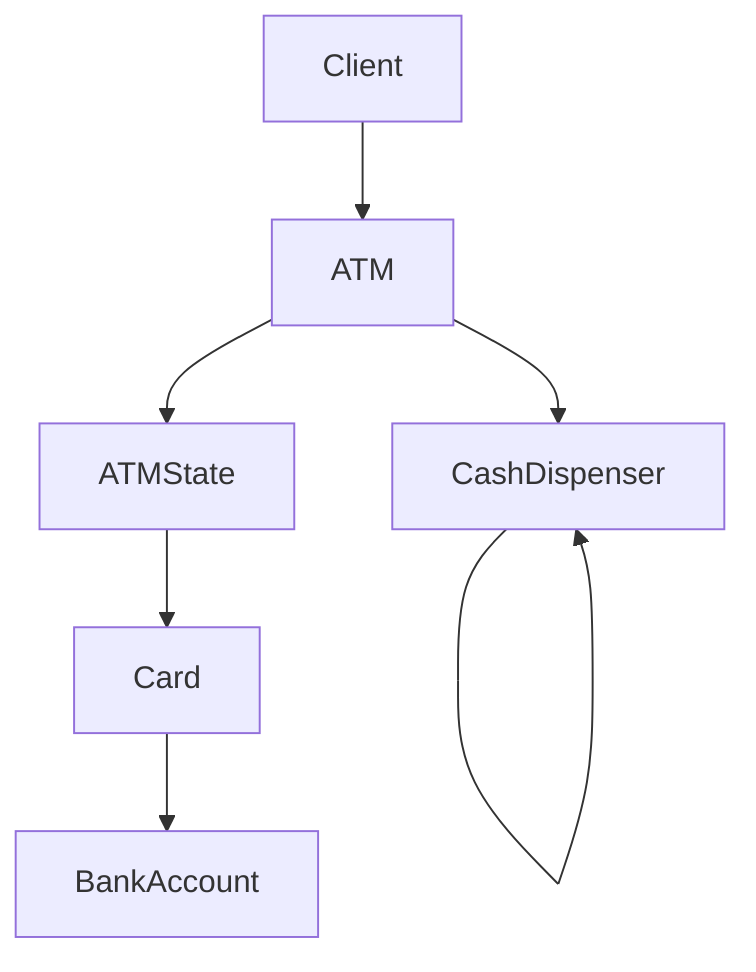

# ATM Machine - LLD

## General Context

Design an ATM machine that allows users to:
- Insert card
- Authenticate using PIN
- Withdraw cash
- Dispense notes
- Check balance
- Eject card

The system is modeled as a state-driven machine where ATM behavior changes depending on its current state.

---

# Phase 1 - Core ATM Workflow

## Supported Features

- Insert card
- Authenticate PIN
- Withdraw cash
- Dispense notes
- Check balance
- Eject card

---

## Out of Scope

- Deposit
- Multi-bank integration
- Real payment network
- ATM cash refill management
- Cardless withdrawal
- Mini statement
- Notifications

---

## Core Entities

| Entity | Responsibility |
|---|---|
| `ATM` | Main machine that delegates behavior to current state |
| `ATMState` | Defines ATM operations based on current state |
| `Card` | User debit/credit card |
| `BankAccount` | Stores account balance |
| `CashDispenser` | Dispenses notes using denomination chain |

---

## Core Flow

```text
Insert Card
      ↓
Enter PIN
      ↓
Authenticate User
      ↓
Withdraw Cash
      ↓
Validate Balance
      ↓
Dispense Notes
      ↓
Eject Card
```

## State Pattern

ATM behavior changes depending on the current state.

| State                | Allowed Actions            |
| -------------------- | -------------------------- |
| `NoCardState`        | Insert card                |
| `CardInsertedState`  | Enter PIN / Eject card     |
| `AuthenticatedState` | Withdraw cash / Eject card |

---
## Chain of Responsibility - Cash Dispensing

Cash dispensing is modeled using Chain of Responsibility.

Each dispenser handles one denomination and forwards the remaining amount to the next dispenser.

> Dispenser Chain - `2000 → 500 → 100`

## Validation Rules
- PIN must be valid
- Account must have sufficient balance
- Withdrawal amount must be a multiple of 100

---
## Architecture Overview

## One Liner Summary
> ATM behavior is modeled using State Pattern, while note dispensing is modeled using Chain of Responsibility.

---


