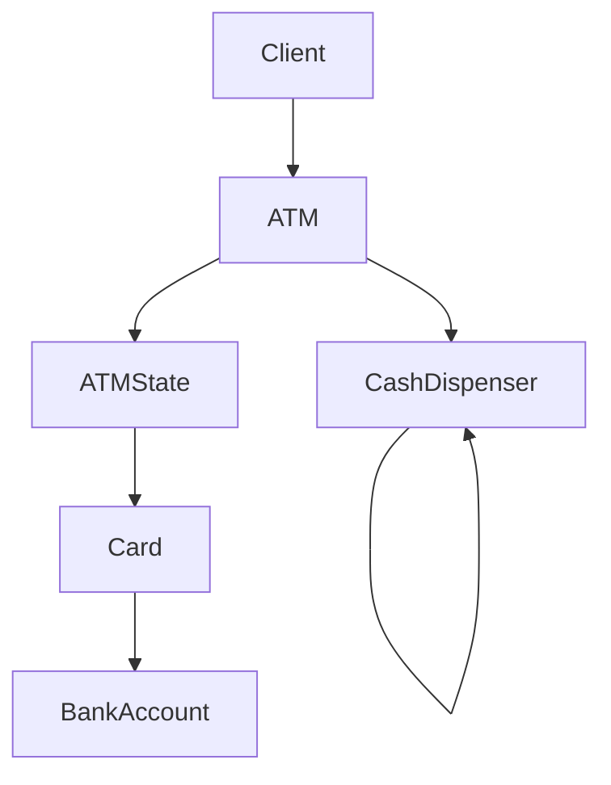
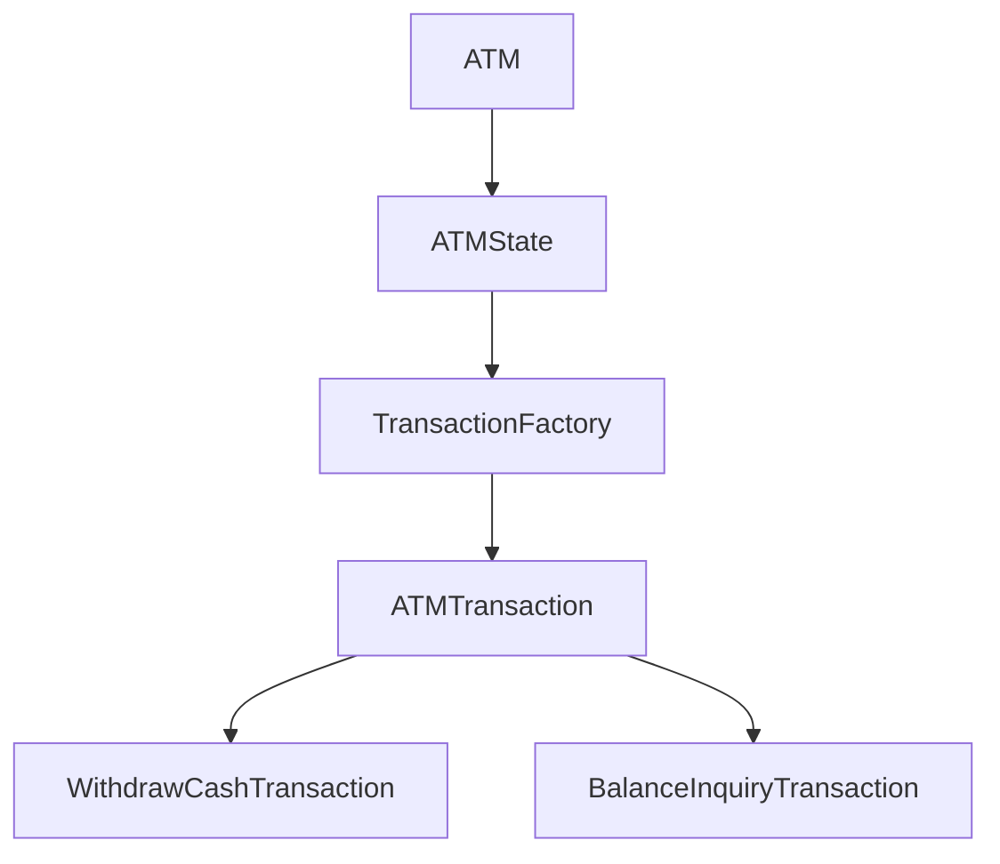

# ATM Machine - LLD

## General Context

Design an ATM machine that allows users to:
- Insert card
- Authenticate using PIN
- Withdraw cash
- Dispense notes
- Check balance
- Eject card

The system is modeled as a state-driven machine where ATM behavior changes depending on its current state.

---

# Phase 1 - Core ATM Workflow

## Supported Features

- Insert card
- Authenticate PIN
- Withdraw cash
- Dispense notes
- Check balance
- Eject card

---

## Out of Scope

- Deposit
- Multi-bank integration
- Real payment network
- ATM cash refill management
- Cardless withdrawal
- Mini statement
- Notifications

---

## Core Entities

| Entity | Responsibility |
|---|---|
| `ATM` | Main machine that delegates behavior to current state |
| `ATMState` | Defines ATM operations based on current state |
| `Card` | User debit/credit card |
| `BankAccount` | Stores account balance |
| `CashDispenser` | Dispenses notes using denomination chain |

---

## Core Flow

```text
Insert Card
      ↓
Enter PIN
      ↓
Authenticate User
      ↓
Withdraw Cash
      ↓
Validate Balance
      ↓
Dispense Notes
      ↓
Eject Card
```

## State Pattern

ATM behavior changes depending on the current state.

| State                | Allowed Actions            |
| -------------------- | -------------------------- |
| `NoCardState`        | Insert card                |
| `CardInsertedState`  | Enter PIN / Eject card     |
| `AuthenticatedState` | Withdraw cash / Eject card |

---
## Chain of Responsibility - Cash Dispensing

Cash dispensing is modeled using Chain of Responsibility.

Each dispenser handles one denomination and forwards the remaining amount to the next dispenser.

> Dispenser Chain - `2000 → 500 → 100`

## Validation Rules
- PIN must be valid
- Account must have sufficient balance
- Withdrawal amount must be a multiple of 100

---
## Architecture Overview

## One Liner Summary
> ATM behavior is modeled using State Pattern, while note dispensing is modeled using Chain of Responsibility.

---


# Phase 2 - Transaction Support

## Goal

Extend the ATM to support multiple transaction types.

Supported transactions:
- Withdraw Cash
- Balance Inquiry

---

## Transaction Flow

```text
Authenticate User
      ↓
Select Transaction
      ↓
Create Transaction
      ↓
Validate
      ↓
Execute
      ↓
Print Receipt
      ↓
Eject Card
````

---

## Factory Pattern

Transaction creation is handled using `TransactionFactory`.

```text
TransactionType → ATMTransaction
```

This avoids transaction creation logic inside ATM states.

Examples:

* `WithdrawCashTransaction`
* `BalanceInquiryTransaction`

---

## Template Method Pattern

All transactions follow a common workflow:

```text
validate → execute → printReceipt
```

This flow is defined inside the abstract `ATMTransaction`.

Concrete transactions implement:

* `validate()`
* `execute()`

---

## Design Decision

| Pattern                 | Responsibility                      |
| ----------------------- | ----------------------------------- |
| Factory Pattern         | Creates correct transaction object  |
| Template Method Pattern | Defines common transaction workflow |

---

## Updated Architecture



---

## One-Line Summary

> Factory Pattern handles transaction creation, while Template Method defines the common transaction execution flow.


---
````md
# Phase 3 - Account Types using Strategy Pattern

## Goal

Support different account types with different withdrawal rules.

Supported account types:
- Savings Account
- Current Account

---

## Strategy Pattern

Account-specific withdrawal behavior is delegated to `AccountTypeStrategy`.

```text
BankAccount
    ↓
AccountTypeStrategy
    ├── SavingsAccountStrategy
    └── CurrentAccountStrategy
````

This avoids account-type based `if-else` checks inside `BankAccount`.

---

## Design Decision

| Pattern          | Responsibility                                 |
| ---------------- | ---------------------------------------------- |
| Strategy Pattern | Encapsulates account-specific withdrawal rules |

---

## One-Line Summary

> Strategy Pattern allows account-specific withdrawal behavior to vary independently from `BankAccount`.

---

# Phase 4 - Concurrency

## Goal

Prevent race conditions during concurrent withdrawals.

Shared resources:
- `BankAccount.balance`
- `CashDispenser`

---

## Synchronization

Critical balance updates are synchronized inside `BankAccount.withdraw()`.

```text
check balance
    ↓
deduct balance
````

This ensures balance validation and deduction happen atomically.

---

## Cash Dispenser Concurrency

Cash dispensing is synchronized to prevent multiple threads from dispensing cash simultaneously.

```text
validate
    ↓
dispense notes
```

---

## Design Decision

| Shared Resource | Protection     |
| --------------- | -------------- |
| Account balance | `synchronized` |
| Cash dispenser  | `synchronized` |

---

## Better Alternatives

| Option           | Use Case                            |
| ---------------- | ----------------------------------- |
| `ReentrantLock`  | Timeout / fairness / tryLock        |
| `Semaphore`      | Limited concurrent dispenser access |
| `@Transactional` | DB-backed balance consistency       |

---

## One-Line Summary

> Synchronization ensures ATM balance updates and cash dispensing remain atomic under concurrent withdrawals.

